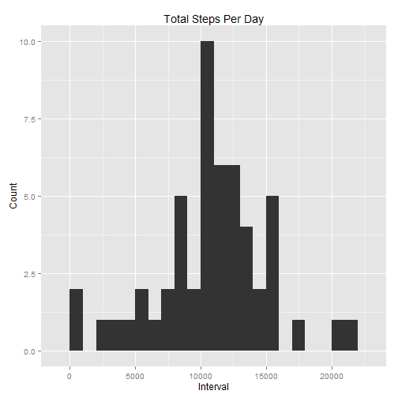
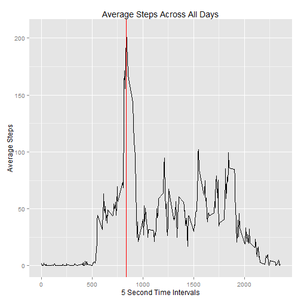
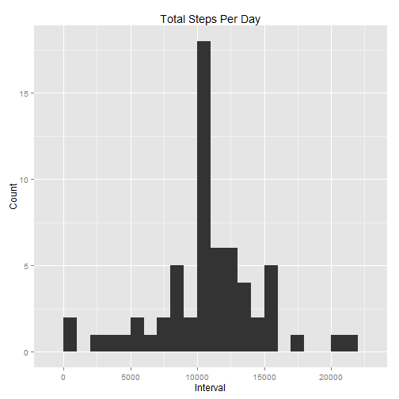
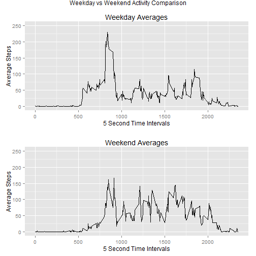

### Reproducible Research: Peer Assessment 1
This report answers peer assessment one questions. This assignment makes use of data from a personal activity monitoring device. This device collects data at 5 minute intervals through out the day. The data consists of two months of data from an anonymous individual collected during the months of October and November, 2012 and include the number of steps taken in 5 minute intervals each day.

### Loading and preprocessing the data

The data for this assignment can be downloaded from the course web site:

- Dataset: [Activity monitoring data](https://d396qusza40orc.cloudfront.net/repdata/data/activity.zip) [52K]

The variables included in this dataset are:

- **steps:** Number of steps taking in a 5-minute interval (missing values are coded as NA)

- **date:** The date on which the measurement was taken in YYYY-MM-DD format

- **interval:** Identifier for the 5-minute interval in which measurement was taken

The dataset is stored in a comma-separated-value (CSV) file and there are a total of 17,568 observations in this dataset.

- The dataset used for this report was accessed on **01/18/2015** at **3:30pm EST**


To begin, let's setup any R libraries used to process the data and read the data file into R.


```r
library("knitr")
library("ggplot2")
library("scales")
library("grid")
library("gridExtra")

# Read Data. The data file should be in your working directory.
  activity <- read.csv(unz("activity.zip", "activity.csv"), header=TRUE)
```

### What is mean total number of steps taken per day?
Next, as per the assignment instructions, we omit any rows with missing data (i.e. NAs) and tally the total steps per day. 

```r
# Remove NAs and put Into Separate Data Table.
activity_clean<-na.omit(activity)
activity_sum <- with(activity_clean, aggregate(steps, by = list(date), sum))
```


#####1. Make a histogram of the total number of steps taken per day

```r
# Generate basic histogram plot
p1 <- qplot(x, data=activity_sum, geom="histogram",binwidth=1000, xlab="Interval", ylab="Count", 
            main="Total Steps Per Day")
print(p1)
```

 


#####2. Calculate and report the mean and median total number of steps taken per day

```r
# Get the mean and median for all the sums
a_mean <- mean(activity_sum$x)
a_median <- median(activity_sum$x)
```

_______________________________________________________________________
The **mean** for total steps taken is **10766.19**


The **median** for total number of steps taken is **10765**

_______________________________________________________________________


### What is the average daily activity pattern?

#####1. Make a time series plot (i.e. type = "l") of the 5-minute interval (x-axis) and the average number of steps taken,
#####   averaged across all days (y-axis)


```r
activity_interval <- aggregate(activity_clean$steps, by=list(activity_clean$interval), FUN=mean)

#Optional just to show which 5 minute interval has maximum steps in plot
maxsteps_plot <- activity_interval$Group.1[which.max(activity_interval$x)]

#Make the plot
p2 <- ggplot(data=activity_interval, aes(x=Group.1, y=x)) + 
        geom_line() +
        geom_vline(xintercept=c(maxsteps_plot), colour="red") +
        ggtitle("Average Steps Across All Days") +
        labs(x="5 Second Time Intervals", y="Average Steps")
      
print(p2)
```

 

#####2. Which 5-minute interval, on average across all the days in the dataset, contains the maximum number of steps?


```r
maxsteps <- activity_interval$Group.1[which.max(activity_interval$x)]
```


_______________________________________________________________________
The 5 minute time interval with the maximum number of steps averaged across all days is time interval **835**

_______________________________________________________________________

### Imputing missing values

#####1. Calculate and report the total number of missing values in the dataset (i.e. the total number of rows with NAs)

```r
num_na <- sum(is.na(activity$steps))
```

_______________________________________________________________________
There are **2304** rows with missing steps values in the original data set.

_______________________________________________________________________

#####2. Devise a strategy for filling in all of the missing values in the dataset. 

_______________________________________________________________________
The strategy for filling in the NAs was to calculate the mean for each 5 minute interval across all days.

_______________________________________________________________________

#####3. Create a new dataset that is equal to the original dataset but with the missing data filled in.

```r
#Get the mean for each 5 minute interval
mean_by_interval <- aggregate(x = activity_clean[c("steps")], FUN = mean, by = list(interval = activity_clean$interval))

#Replace NAs with corresoponding average 5 minute interval data
activity_temp <- merge(activity, mean_by_interval, by=c("interval"))
        activity_temp$steps.x[is.na(activity_temp$steps.x)] <- activity_temp$steps.y[is.na(activity_temp$steps.x)] 
        activity_temp$steps.y <- NULL
        activity_allsum <- with(activity_temp, aggregate(steps.x, by = list(date), sum))
```

#####4. Make a histogram of the total number of steps taken each day. 
Calculate and report the mean and median total number of steps taken per day. Do these values differ from the estimates from the first part of the assignment? What is the impact of imputing missing data on the estimates of the total daily number of steps?


```r
p3 <- qplot(x, data=activity_allsum, geom="histogram", binwidth=1000, xlab="Interval", ylab="Count", 
            main="Total Steps Per Day")
print(p3)
```

 

```r
# Get the mean and median for all the sums no NAs
b_mean <- mean(activity_allsum$x)
b_median <- median(activity_allsum$x)
```

_______________________________________________________________________
The **mean** for total steps taken is **10766.19**


The **median** for total number of steps taken is **10766.19**

_______________________________________________________________________

As shown below, after inputing the NAs the mean and median values are now exactly the same. Imputing the NAs has changed the  median. 

Ignoring NAs|Imputing NAs
-|-
Mean: 10766.19|Mean: 10766.19
Median: 10765|Median: 10766.19


### Are there differences in activity patterns between weekdays and weekends?
#####1. Create a new factor variable in the dataset with two levels -- "weekday" and "weekend" indicating whether a given date is a weekday or weekend day.

```r
# Weekday vs. Weekend.
activity_temp$daytype <- as.factor(ifelse(weekdays(as.Date(activity_temp$date)) %in% c("Saturday","Sunday"), "Weekend", "Weekday")) 
```

#####2. Make a panel plot containing a time series plot (i.e. type = "l") of the 5-minute interval (x-axis) and the average number of steps taken, averaged across all weekday days or weekend days (y-axis).

```r
# Setup Plots and Create Panel 
activity_weekday <- aggregate(steps.x~interval,data=subset(activity_temp,daytype=="Weekday"),mean)
activity_weekend <- aggregate(steps.x~interval,data=subset(activity_temp,daytype=="Weekend"),mean)

p4 <- ggplot(data=activity_weekday, aes(x=interval, y=steps.x)) + 
        geom_line() +
        ggtitle("Weekday Averages") +
        labs(x="5 Second Time Intervals", y="Average Steps") +
        ylim(0, 250)
           
p5 <- ggplot(data=activity_weekend, aes(x=interval, y=steps.x)) + 
        geom_line() +
        ggtitle("Weekend Averages") +
        labs(x="5 Second Time Intervals", y="Average Steps") +
        ylim(0, 250)

multi <- arrangeGrob(p4, p5, ncol=1, main="Weekday vs Weekend Activity Comparison")

print(multi)
```

 

As shown in the above plots, there is a difference between weekday and weekend activity.  

_______________________________________________________________________
